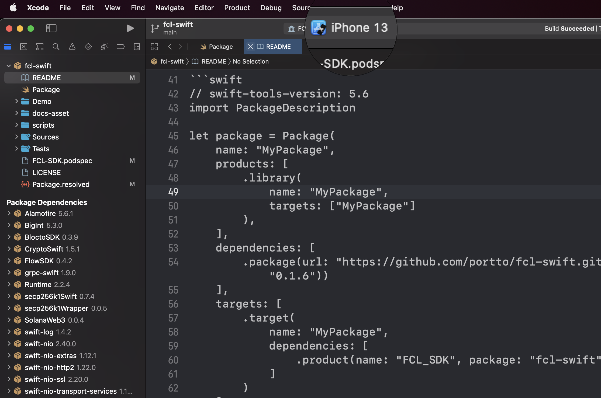
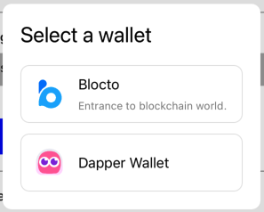

<a href="https://cocoapods.org/pods/FCL-SDK"></a>
<a href="https://swift.org/package-manager/"></a>

## What is FCL?

The Flow Client Library (FCL) is used to interact with user wallets and the Flow blockchain. When using FCL for authentication, dApps are able to support all FCL-compatible wallets on Flow and their users without any custom integrations or changes needed to the dApp code.

For more description, please refer to [fcl.js](https://github.com/onflow/fcl-js)

This repo is inspired by [fcl-js](https://github.com/onflow/fcl-js) and [fcl-swift](https://github.com/Outblock/fcl-swift)

---
## Getting Started

### Requirements
-  Swift version >= 5.6
-  iOS version >= 13

## Installation

### CocoaPods

FCL-SDK is available through [CocoaPods](https://cocoapods.org). You can include specific subspec to install, simply add the following line to your Podfile:

```ruby
pod 'FCL-SDK', '~> 0.3.3'
```

### Swift Package Manager


```swift
.package(url: "https://github.com/portto/fcl-swift.git", .upToNextMinor(from: "0.3.3"))
```

Here's an example PackageDescription:

```swift
// swift-tools-version: 5.6
import PackageDescription

let package = Package(
    name: "MyPackage",
    products: [
        .library(
            name: "MyPackage",
            targets: ["MyPackage"]
        ),
    ],
    dependencies: [
        .package(url: "https://github.com/portto/fcl-swift.git", .upToNextMinor(from: "0.3.3"))
    ],
    targets: [
        .target(
            name: "MyPackage",
            dependencies: [
                .product(name: "FCL_SDK", package: "fcl-swift"),
            ]
        )
    ]
)
```

### Platform

We only support iOS platform now. Please switch your XCode build target to iOS device.


### Importing

```swift
import FCL_SDK
```
---
## FCL for dApps
### Configuration

Initialize `WalletProvider` instance e.g. `BloctoWalletProvider`, `DapperWalletProvider`. And simply specify `network` and put those wallet providers into config option `supportedWalletProviders` then you are good to go.

```swift
import FCL_SDK

do {
    let bloctoWalletProvider = try BloctoWalletProvider(
        bloctoAppIdentifier: bloctoSDKAppId,
        window: nil,
        network: .testnet
    )
    fcl.config
        .put(.network(.testnet))
        .put(.supportedWalletProviders(
            [
                bloctoWalletProvider,
            ]
        ))
} catch {
    // handle error
}

Task {
    try await fcl.login()
}
```

> **Note**: bloctoSDKAppId can be found in [Blocto Developer Dashboard](https://developers.blocto.app/), for detail instruction please refer to [Blocto Docs](https://docs.blocto.app/blocto-sdk/register-app-id)

### User Signatures

Cryptographic signatures are a key part of the blockchain. They are used to prove ownership of an address without exposing its private key. While primarily used for signing transactions, cryptographic signatures can also be used to sign arbitrary messages.

FCL has a feature that let you send arbitrary data to a configured wallet/service where the user may approve signing it with their private keys.

We can retrieve user signatures only after user had logged in, otherwise error will be thrown.

```swift
Task {
    do {
        let signatures: [FCLCompositeSignature] = try await fcl.signUserMessage(message: "message you want user to sign.")
    } catch {
        // handle error
    }
}
```

The message could be signed by several private key of the same wallet address. Those signatures will be valid all together as long as their corresponding key weight sum up at least 1000.
For more info about multiple signatures, please refer to [Flow docs](https://developers.flow.com/learn/concepts/accounts-and-keys#single-party-multiple-signatures)


### Blockchain Interactions
- *Query the chain*: Send arbitrary Cadence scripts to the chain and receive back decoded values
```swift
import FCL_SDK

let script = """
import ValueDapp from \(valueDappContract)

pub fun main(): UFix64 {
    return ValueDapp.value
}
"""

Task {
    let argument = try await fcl.query(script: script)
    label.text = argument.value.description
}
```
- *Mutate the chain*: Send arbitrary transactions with specify authorizer to perform state changes on chain.
```swift
import FCL_SDK

Task { @MainActor in
    guard let userWalletAddress = fcl.currentUser?.address else {
        // handle error
        return
    }

    let scriptString = """
    import ValueDapp from 0x5a8143da8058740c

    transaction(value: UFix64) {
        prepare(authorizer: AuthAccount) {
            ValueDapp.setValue(value)
        }
    }
    """

    let argument = Cadence.Argument(.ufix64(10))

    let txHsh = try await fcl.mutate(
        cadence: scriptString,
        arguments: [argument],
        limit: 100,
        authorizers: [userWalletAddress]
    )
}
```

[Learn more about on-chain interactions >](https://docs.onflow.org/fcl/reference/api/#on-chain-interactions)

---
## Prove ownership
To prove ownership of a wallet address, there are two approaches.
- Account proof: in the beginning of authentication, there are `accountProofData` you can provide for user to sign and return generated signatures along with account address. 

`fcl.authanticate` is also called behide `fcl.login()` with accountProofData set to nil.

```swift
let accountProofData = FCLAccountProofData(
    appId: "Here you can specify your app name.",
    nonce: "75f8587e5bd5f9dcc9909d0dae1f0ac5814458b2ae129620502cb936fde7120a" // minimum 32-byte random nonce as a hex string.
)
let address = try await fcl.authanticate(accountProofData: accountProofData)
```

- [User signature](#User-Signatures): provide specific message for user to sign and generate one or more signatures.

### Verifying User Signatures

What makes message signatures more interesting is that we can use Flow blockchain to verify the signatures. Cadence has a built-in function called verify that will verify a signature against a Flow account given the account address.

FCL includes a utility function, verifyUserSignatures, for verifying one or more signatures against an account's public key on the Flow blockchain.

You can use both in tandem to prove a user is in control of a private key or keys. This enables cryptographically-secure login flow using a message-signing-based authentication mechanism with a user’s public address as their identifier.

To verify above ownership, there are two utility functions define accordingly in [AppUtilities](https://github.com/portto/fcl-swift/blob/main/Sources/FCL-SDK/AppUtilities/AppUtilities.swift).

---
## Utilities
- Get account details from any Flow address
```swift
let account: Account? = try await fcl.flowAPIClient.getAccountAtLatestBlock(address: address)
```
- Get the latest block
```swift
let block: Block? = try await fcl.flowAPIClient.getLatestBlock(isSealed: true)
```
- Transaction status polling
```swift
let result = try await fcl.getTransactionStatus(transactionId: txHash)
```

[Learn more about utilities >](https://docs.onflow.org/fcl/reference/api/#pre-built-interactions)

---
## FCL for Wallet Providers
Wallet providers on Flow have the flexibility to build their user interactions and UI through a variety of ways:
- Native app intercommunication via Universal links or custom schemes.
- Back channel communication via HTTP polling with webpage button approving.

FCL is agnostic to the communication channel and be configured to create both custodial and non-custodial wallets. This enables users to interact with wallet providers both native app install or not.

Native app should be considered first to provide better user experience if installed, otherwise fallback to back channel communication.

The communication channels involve responding to a set of pre-defined FCL messages to deliver the requested information to the dApp.  Implementing a FCL compatible wallet on Flow is as simple as filling in the responses with the appropriate data when FCL requests them.


### Current Wallet Providers
- [Blocto](https://blocto.portto.io/en/) (fully supported) [Docs](https://docs.blocto.app/blocto-sdk/ios-sdk/flow)
- [Dapper Wallet](https://www.meetdapper.com/) (support only authn for now)

### Wallet Selection
- dApps can display and support all FCL compatible wallets who conform to `WalletProvider`.
- Users don't need to sign up for new wallets - they can carry over their existing one to any dApps that use FCL for authentication and authorization.
- Wallet selection panel will be shown automatically when `login()` is being called only if there are more than one wallet provider in `supportedWalletProviders`.


```swift
import FCL_SDK

do {
    let bloctoWalletProvider = try BloctoWalletProvider(
        bloctoAppIdentifier: bloctoSDKAppId,
        window: nil,
        network: .testnet
    )
    let dapperWalletProvider = DapperWalletProvider.default
    fcl.config
        .put(.network(.testnet))
        .put(.supportedWalletProviders(
            [
                bloctoWalletProvider,
                dapperWalletProvider,
            ]
        ))
} catch {
    // handle error
}

Task {
    try await fcl.login()
}
```

### Building your own wallet provider

- Declare a wallet provider type and conform the protocol [WalletProvider](./Sources/FCL-SDK/WalletProvider/WalletProvider.swift).
- If building a wallet involve back channel communication, read the [wallet guide](https://github.com/onflow/fcl-js/blob/master/packages/fcl/src/wallet-provider-spec/draft-v3.md) first to build the concept of the implementation and use method from `WalletProvider` to fulfill your business logic.

Every walllet provider can use below property from `WalletProvider` to customize icon, title and description. Those info will be shown [here](#wallet-selection).
```
var providerInfo: ProviderInfo { get }
```

---

## Next Steps

Learn Flow's smart contract language to build any script or transactions: [Cadence](https://docs.onflow.org/cadence/).

Explore all of Flow [docs and tools](https://docs.onflow.org).

---

## Support

Notice a problem or want to request a feature? [Add an issue](https://github.com/portto/fcl-swift/issues) or [Make a pull request](https://github.com/portto/fcl-swift/compare).
